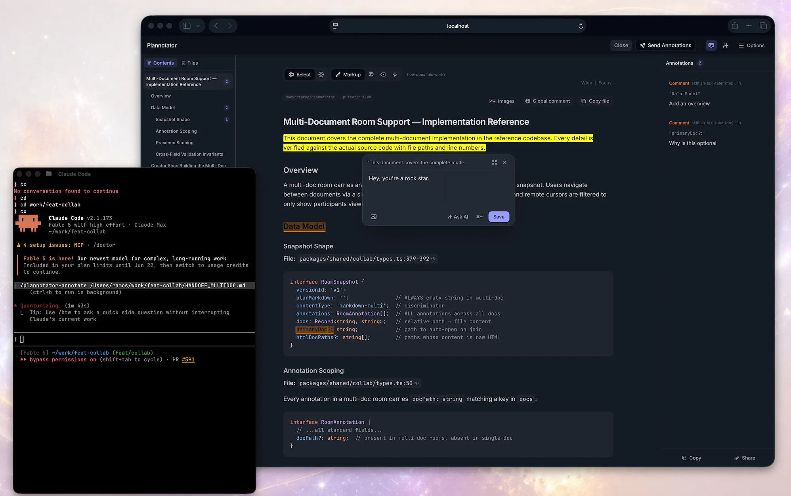
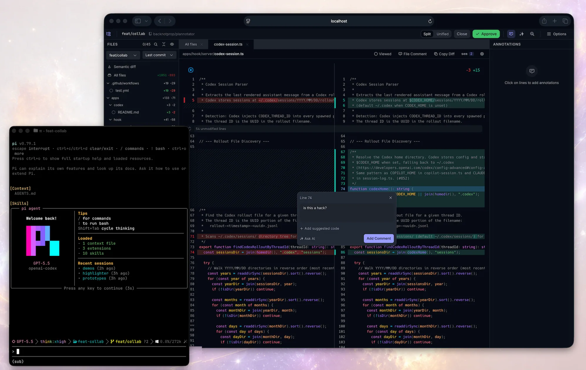
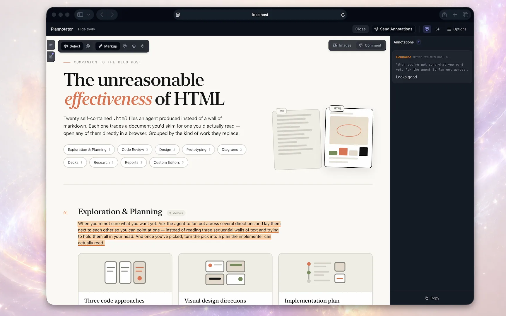
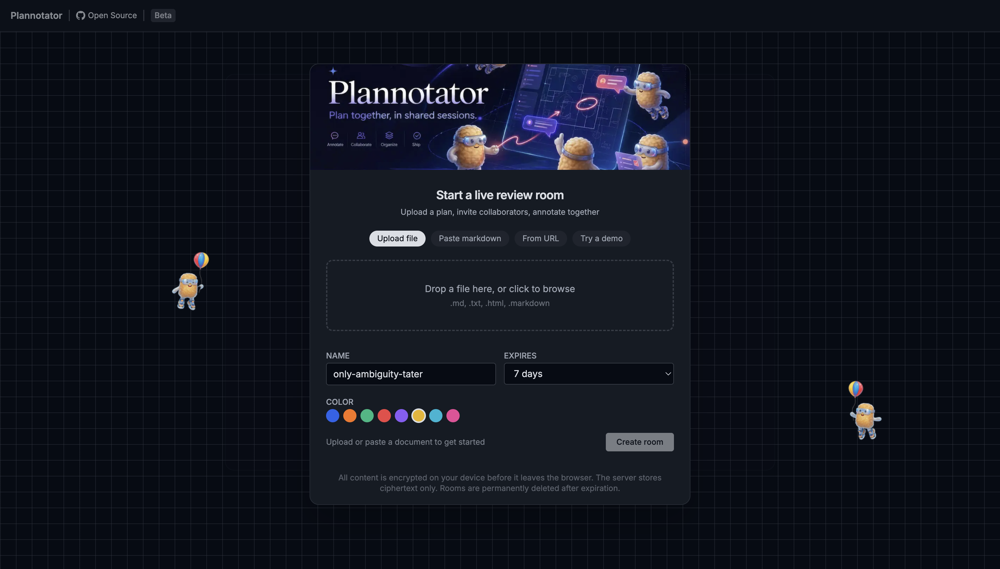

<p align="center">
  
</p>


<p align="center">
  <strong>Everything you need to annotate and stay in the loop with your agents</strong><br/>
  <strong>Markdown Review • Code Review • HTML Artifacts</strong><br/>
  <sub>Annotate plans, specs, markdown, and HTML before implementation. Review diffs and PRs. Send feedback to your agent.</sub>
</p>

<p align="center">
  &nbsp;&nbsp;
  &nbsp;&nbsp;
  &nbsp;&nbsp;
  <picture>
    <source media="(prefers-color-scheme: dark)" srcset=".github/assets/icons/copilot-dark.svg" />
    
  </picture>&nbsp;&nbsp;
  &nbsp;&nbsp;
  &nbsp;&nbsp;
  &nbsp;&nbsp;
  <picture>
    <source media="(prefers-color-scheme: dark)" srcset=".github/assets/icons/opencode-dark.svg" />
    
  </picture>&nbsp;&nbsp;
  <picture>
    <source media="(prefers-color-scheme: dark)" srcset=".github/assets/icons/pi-dark.svg" />
    
  </picture>
</p>

<p align="center">
  <a href="https://www.youtube.com/watch?v=a_AT7cEN_9I">Watch the og demo</a> · <a href="https://sureagents.ai/docs/getting-started/installation/">Installation guide</a> · <a href="https://sureagents.ai/">Official site</a>
</p>

# SureAgents

SureAgents is a local, browser-based review surface for AI coding agents: Claude Code, Codex, Copilot CLI, Gemini CLI, OpenCode, Kiro, Droid, Amp, and Pi. 

**It plugs directly into your agent** through its hooks and commands. When the agent proposes a plan, html, or finishes writing code, the work opens in your browser and you mark it up, comment, and send feedback directly to the agent for it to act on it.

<table>
<tr>
<td width="40%" valign="middle">

### Review documents, plans, and agent messages

Annotate plans, specs, messages, html, then send the feedback to your agent. 

<p><strong>Demo:</strong> <a href="https://youtu.be/XqFun9XCXPw">Plan review with Pi</a></p>

</td>
<td width="60%">



</td>
</tr>
<tr>
<td width="40%" valign="middle">

### Code Review

Review local changes or remote PRs. Comment on diffs, suggest code. Your comments go back to the agent. Works with git, jj, p4, GitHub, and GitLab.

</td>
<td width="60%">



</td>
</tr>
</table>

<p align="center">
  <sub><strong>AI built in:</strong> ask AI about anything you're reviewing,<br/>or launch AI reviews that post comments to the diff.</sub>
</p>

## Annotate HTML Artifacts

<p align="center">
  
</p>

---

## Commands

<sub>On Codex, swap the slash commands for `!sureagents …` (e.g. `!sureagents review`) or the `$sureagents-*` skills.</sub>

### Annotate

```
/sureagents-annotate README.md                  # Local markdown file
/sureagents-annotate src/                       # Browse and annotate files in a folder
/sureagents-annotate https://docs.rs/…          # Fetch and annotate any URL
/sureagents-annotate report.html --render-html  # Render HTML as-is instead of converting
/sureagents-last                                # Annotate the agent's last message
```

### Code review

```
/sureagents-review                    # Review uncommitted changes
/sureagents-review <github-pr-url>    # Review a GitHub pull request
/sureagents-review <gitlab-mr-url>    # Review a GitLab merge request
```

### Plan mode

No command needed. Plan mode is wired in through each harness's hooks. Any time your agent creates a plan, the markdown review surface opens for you.

### CLI

```
sureagents sessions                   # List active SureAgents sessions
sureagents sessions --open 1          # Reopen a session in the browser
sureagents archive                    # Browse saved plan decisions read-only
```

---

## Sharing &amp; Multiplayer

<p align="center">
  <a href="https://room.sureagents.ai/">
    
  </a>
</p>

<p align="center">
  <sub>Beta: <a href="https://room.sureagents.ai/">room.sureagents.ai</a></sub>
</p>

<p align="center">
  <a href="https://sureagents.ai/workspaces">
    
  </a>
</p>

Share a plan with a teammate and they can annotate it themselves. Import their feedback and send it straight back to your agent.

**Small plans** are encoded entirely in the URL hash. No server involved. The data lives in the link itself.

**Large plans** go through a short-link service, encrypted in your browser with AES-256-GCM. The server stores only ciphertext, and the key never leaves the URL fragment. Pastes auto-delete after 7 days.

Same model as [PrivateBin](https://privatebin.info/). The paste service is [self-hostable](https://sureagents.ai/docs/guides/sharing-and-collaboration/).

Sharing can be disabled entirely with `SUREAGENTS_SHARE=disabled`.

**Coming next:** live collaboration. Teammates and their agents working through the same plan or review together, in real time. It arrives in Workspaces once the room beta wraps. [Sign up here](https://sureagents.ai/workspaces).


---

## Install

One installer covers almost every agent. It installs the `sureagents` binary, auto-detects your installed agents, and configures hooks, skills, and slash commands for each:

```bash
# macOS / Linux / WSL
curl -fsSL https://sureagents.ai/install.sh | bash
```

```powershell
# Windows PowerShell
irm https://sureagents.ai/install.ps1 | iex
```

Then finish the step for your agent:

| Agent | After the installer | Details |
|---|---|---|
| **Amp** | Copy [`sureagents.ts`](apps/amp-plugin/sureagents.ts) into `~/.config/amp/plugins/`, then `plugins: reload`. Workflows live in the command palette. | [README](apps/amp-plugin/README.md) |
| **Claude Code** | `/plugin marketplace add suryansh1914/sureagents`, then `/plugin install sureagents@sureagents`. Restart Claude Code. | [README](apps/hook/README.md) |
| **Codex** | Nothing. Plan review is enabled automatically via Codex's experimental `Stop` hook (macOS/Linux/WSL; Codex hooks are disabled on Windows). `$sureagents-review`, `$sureagents-annotate`, and `$sureagents-last` skills included. | [README](apps/codex/README.md) |
| **Copilot CLI** | `/plugin marketplace add suryansh1914/sureagents`, then `/plugin install sureagents-copilot@sureagents`. Restart. Plan review activates in plan mode (`Shift+Tab`). | [README](apps/copilot/README.md) |
| **Droid** | `droid plugin marketplace add https://github.com/suryansh1914/sureagents`, then `droid plugin install sureagents@sureagents`. Commands only, no plan interception yet. | [README](apps/droid-plugin/README.md) |
| **Gemini CLI** | Nothing. The hook, policy, and slash commands are configured automatically. Requires Gemini CLI 0.36.0+. | [README](apps/gemini/README.md) |
| **Kiro CLI** | Nothing. Skills and an example agent are installed automatically. Try `kiro-cli chat --agent sureagents`. | [README](apps/kiro-cli/README.md) |
| **OpenCode** | Add `"plugin": ["@sureagents/opencode@latest"]` to `opencode.json`. Restart OpenCode. | [README](apps/opencode-plugin/README.md) |
| **Pi** | Skip the installer. Just `pi install npm:@sureagents/pi-extension`. Start Pi with `--plan`, or toggle with `/sureagents`. | [README](apps/pi-extension/README.md) |

Full walkthroughs live in the [installation docs](https://sureagents.ai/docs/getting-started/installation/).

<details>
<summary>Claude Code: manual hook setup (without the plugin system)</summary>

Add to `~/.claude/settings.json`:

```json
{
  "hooks": {
    "PermissionRequest": [
      {
        "matcher": "ExitPlanMode",
        "hooks": [
          {
            "type": "command",
            "command": "sureagents",
            "timeout": 345600
          }
        ]
      }
    ]
  }
}
```

</details>

<details>
<summary>Pin a specific version</summary>

```bash
curl -fsSL https://sureagents.ai/install.sh | bash -s -- --version vX.Y.Z
```

```powershell
& ([scriptblock]::Create((irm https://sureagents.ai/install.ps1))) -Version vX.Y.Z
```

</details>

### Try it

The fastest way to see what SureAgents does is to invoke it yourself, right now, from your agent:

```
/sureagents-last                   # annotate the agent's last reply
/sureagents-review                 # review your current diff, PR-style
/sureagents-annotate report.html   # annotate any file, folder, or URL
```

(Slash commands in most agents; `$sureagents-*` skills in Codex, command palette in Amp.)

Plan review needs no command at all. The next time your agent proposes a plan, it opens in your browser automatically.

---

## How it works

### Plan review

```
Agent calls ExitPlanMode
  -> PermissionRequest hook fires
  -> Local server reads plan from hook input
  -> Browser opens with review UI
  -> You annotate and approve/deny
  -> Approve: agent proceeds
  -> Deny: structured feedback sent to agent
  -> Agent revises, plan diff shows what changed
```

### Code review

```
You run /sureagents-review
  -> git diff captures changes (or PR fetched by URL)
  -> Browser opens with diff viewer
  -> Annotate lines, stage/unstage files
  -> Send feedback: returned to agent session
  -> Approve: "LGTM" sent
```

---

## Integrations

**VS Code**: Open plans in editor tabs, view diffs inline, add annotations from the editor gutter. Install from the [VS Code Marketplace](https://marketplace.visualstudio.com/items?itemName=backnotprop.sureagents-webview).

**Obsidian**: Auto-save approved plans to a vault with YAML frontmatter, tags from the plan title, and backlinks for graph connectivity. Configure in SureAgents's Settings panel.

**Bear**: Save plans as Bear notes with nested tags and project metadata.

**GitHub / GitLab**: Pass any PR or MR URL to `/sureagents-review` and review it with the full diff viewer, annotations, and file tree.

---

## Remote / SSH / devcontainer

SureAgents auto-detects SSH sessions and switches to a fixed port. For explicit control:

```bash
export SUREAGENTS_REMOTE=1
export SUREAGENTS_PORT=9999  # forward this port
```

VS Code devcontainers forward the port automatically (check the Ports tab). For raw SSH, add to `~/.ssh/config`:

```
Host your-server
    LocalForward 9999 localhost:9999
```

---

## Security

Every released binary ships with a SHA256 sidecar. [SLSA provenance](https://slsa.dev/) attestations are available from v0.17.2.

To verify on install:

```bash
curl -fsSL https://sureagents.ai/install.sh | bash -s -- --verify-attestation
```

Requires `gh` installed and authenticated. Can also be set persistently in `~/.sureagents/config.json`:

```json
{ "verifyAttestation": true }
```

See the [verification docs](https://sureagents.ai/docs/getting-started/installation/#verifying-your-install) for details.

---

## Configuration

Settings are saved in cookies (not localStorage) because each hook invocation runs on a random port. You can also set options through environment variables or `~/.sureagents/config.json`.

| Variable | Description |
|---|---|
| `SUREAGENTS_REMOTE` | `1`/`true` for remote mode, `0`/`false` for local, unset for SSH auto-detection |
| `SUREAGENTS_PORT` | Fixed port (default: random locally, `19432` remote) |
| `SUREAGENTS_BROWSER` | Custom browser to open plans in |
| `SUREAGENTS_SHARE` | `disabled` to turn off URL sharing |
| `SUREAGENTS_SHARE_URL` | Custom base URL for share links (self-hosted portal) |
| `SUREAGENTS_PASTE_URL` | Base URL of the paste service API |
| `SUREAGENTS_ORIGIN` | Override agent detection: `claude-code`, `amp`, `droid`, `opencode`, `codex`, `copilot-cli`, `gemini-cli`, `kiro-cli`, `pi` |
| `SUREAGENTS_JINA` | `0`/`false` to disable Jina Reader for URL annotation |
| `JINA_API_KEY` | Jina Reader API key for higher rate limits |

---

## Development

```bash
bun install

bun run dev:hook       # Plan review server
bun run dev:review     # Code review editor
bun run dev:marketing  # Marketing site (sureagents.ai)
bun run dev:vscode     # VS Code extension (watch mode)
```

### Build

```bash
bun run build          # Main targets (hook + opencode)
bun run build:hook     # Single-file HTML for the hook server
bun run build:review   # Code review editor
bun run build:opencode # OpenCode plugin
bun run build:vscode   # VS Code extension
```

Build order matters. The hook build copies pre-built HTML from `apps/review/dist/`. If you change UI code in `packages/ui/`, `packages/editor/`, or `packages/review-editor/`, rebuild the review app first:

```bash
bun run --cwd apps/review build && bun run build:hook
```

Test the plugin locally:

```bash
claude --plugin-dir ./apps/hook
```

Full binary build:

```bash
bun run --cwd apps/review build && bun run build:hook && \
  bun build apps/hook/server/index.ts --compile --outfile ~/.local/bin/sureagents
```


---

## License

Copyright 2025-2026 backnotprop

Dual-licensed under [Apache 2.0](LICENSE-APACHE) or [MIT](LICENSE-MIT) at your option.

Contributions are dual-licensed under the same terms unless you explicitly state otherwise.
